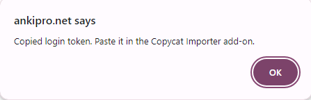

This Chrome extension helps you import flashcards from [AnkiPro](https://ankipro.net/) to the [real Anki](https://apps.ankiweb.net/).
It works as a companion to the [Copycat Importer](https://ankiweb.net/shared/info/2072125761) Anki add-on.
It's only needed for users that have difficulty logging in to their AnkiPro accounts via the add-on.

## Usage

1. Install the [Copycat Importer](https://ankiweb.net/shared/info/2072125761) Anki add-on.
2. Open [ankipro.net](https://ankipro.net/) in Chrome and log in to your account.
3. Click on the extension's icon. You should see a message like this.

4. Go to _Tools > Copycat Importer > Import from AnkiPro_.
5. Paste the login token to the text field.
6. Click Import

## Download

Download the extension from the Chrome web store: https://chromewebstore.google.com/detail/ankipro-export-helper/ghmmlnlfpghgbecgkiananhlbfakmcpd
